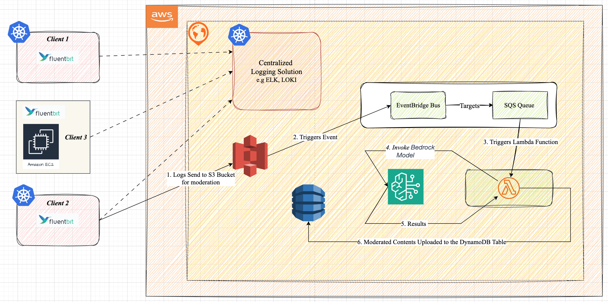

# PII_Detection_Using_AmazonBedrock
```
This POC demonstrates how to build a serverless log moderation pipeline using Amazon Bedrock to detect PII (Personally Identifiable Information) in logs collected from distributed systems like EKS or EC2.

By leveraging Amazon Bedrock in a serverless pipeline, we achieve:
  - Real-time content moderation
  - Serverless architecture (zero-maintenance)
  - Modular design for future expansion (alerting, redaction, visual dashboards)
```

## Project Structure
```
  ├── main.py            # Lambda function code
  ├── prompts.py         # Prompt templates for content classification and responses
  ├── .env               # Stores environment variables
```

## Architecture Overview:
```
The system consists of:
  ├── Amazon S3
  ├── Amazon EventBridge
  ├── Amazon SQS
  ├── AWS Lambda
  ├── Amazon Bedrock
  ├── Amazon DynamoDB
```


## Implementation Steps:
```
- Create an Amazon S3 Bucket. Enable EventBridge notifications on all object
  creation events to detect when new logs are uploaded.
- Create a DynamoDB Table. The Table stores results from the Amazon Bedrock
  model, including whether PII was detected.
- Create a Lambda Function. This function performs the moderation workflow:
    1. Process messages from an AWS SQS event.
    2. Retrieve content files from the S3 bucket.
    3. Analyze each message for personal information (PII) using Amazon Bedrock.
    4. Finally, store the analyzed results in a DynamoDB table.
- Configure the SQS queue to trigger a Lambda function
- Create EventBridge rules to trigger the SQS queue
- Enable the Bedrock model to carry out content moderation, if not already done
```
